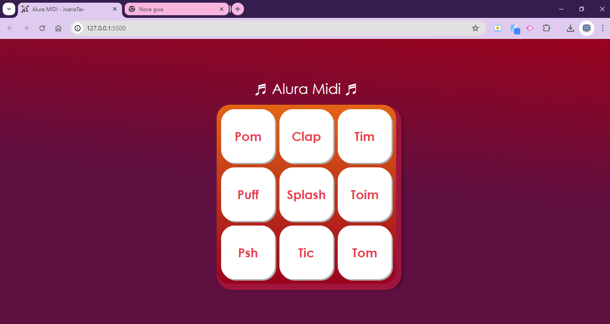

<h1>Alura Midi</h1>

Projeto realizado durante a Formação Front End T6 - ONE Oracle + Alura

JavaScript para Web: Crie páginas dinâmicas

Nesse curso foi desenvolvido o projeto Alura Midi, que consiste em uma mesa de som virtual, onde cada botão reproduz o som de um instrumento. 
Não resisti e fiz algumas pequenas mudanças no projeto original deixando mais personalizado 🎨

 Deploy: https://joanatav.github.io/alura-midi-JoanaTav/ 

<h2>Preview 👀 </h2>

<h2>Projeto Original Alura</h2>

<h2>⚙️Tecnologias Utilizadas</h2>

